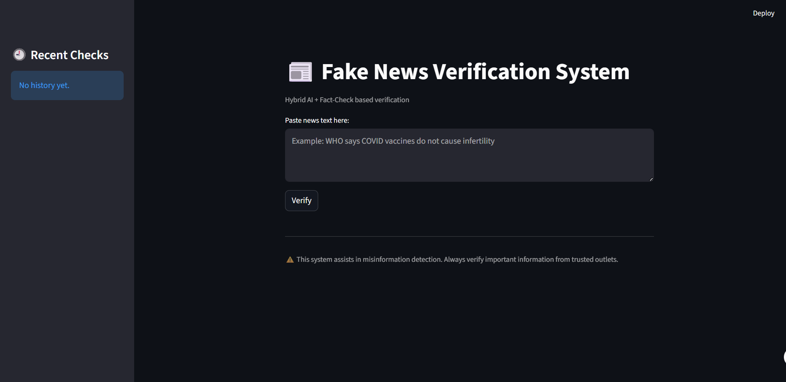
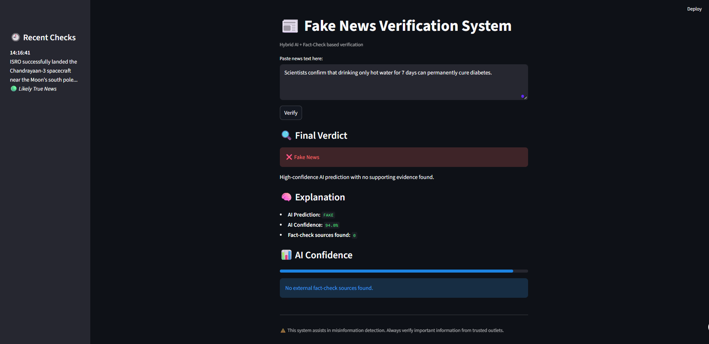
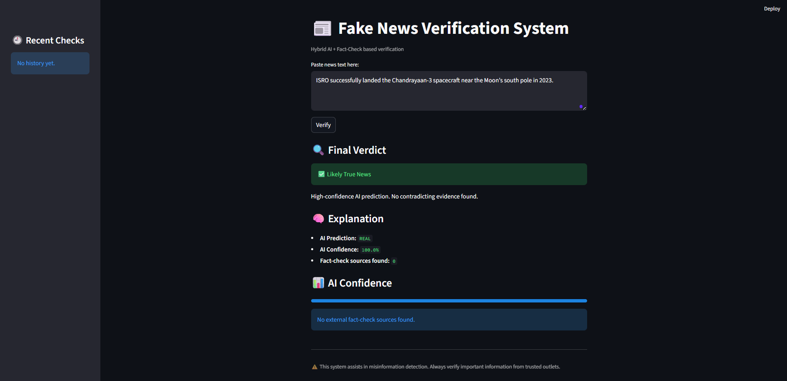

<h1 align="center">📰 Fake News Verification System</h1>
<p align="center">
Hybrid AI + Fact-Check Based Misinformation Detection System
</p>
<h3 align="center">Designed & Engineered by SATYAM SINHA</h3>

> A Machine Learning based web application that classifies news articles as **Real** or **Fake** using NLP techniques.

---

## 📌 Project Overview

The **Fake News Detection System** is a Natural Language Processing (NLP) project that analyzes news text and predicts whether it is **genuine** or **misleading**.

This project demonstrates:

* Text preprocessing
* Feature extraction (TF-IDF)
* Machine Learning model training
* Model evaluation
* Web deployment (if applicable)

---

## 🚀 Features

✔ Text cleaning and preprocessing
✔ Stopword removal and tokenization
✔ TF-IDF vectorization
✔ Multiple ML model comparison
✔ Accuracy & performance evaluation
✔ User-friendly interface

---

## 🧠 Technologies Used

* **Python**
* **Scikit-learn**
* **Pandas**
* **NumPy**
* **NLTK**
* **Streamlit**
* **Matplotlib (for visualization)**

---

## 📂 Dataset

* Public Fake News dataset (e.g., Kaggle Fake & Real News Dataset)
* Contains labeled news articles as **Fake (0)** and **Real (1)**

---

## ⚙️ How It Works

1. Input news text
2. Preprocessing:

   * Lowercasing
   * Removing punctuation
   * Removing stopwords
   * Stemming/Lemmatization
3. Convert text → TF-IDF vectors
4. Pass to trained ML model
5. Output prediction (Fake / Real)

---

## 🖥 Installation & Setup

```bash
# Clone repository
git clone https://github.com/yourusername/fake-news-detection.git

# Go into project directory
cd fake-news-detection

# Install dependencies
pip install -r requirements.txt

# Run application
python app.py
```

---

## 📈 Future Improvements

* Deep Learning (LSTM / BERT)
* Real-time news API integration
* Model deployment on cloud
* UI improvements
* Explainable AI integration

---

## 📌 Example Usage

Input:

```
Breaking: Government announces new economic reform policies.
```

Output:

```
Prediction: Real News
Confidence: 92%
```

---

## 🧪 Project Structure

```
fake-news-detection/
│
├── data/
├── models/
├── app.py
├── train.py
├── requirements.txt
└── README.md
```
## 📸 Application Preview

### 🏠 Home Page
<p align="center">
  
</p>

### ❌ Fake News Detection
<p align="center">
  
</p>

### ✅ True News Detection
<p align="center">
  
</p>

---

## 🤝 Contribution

Contributions are welcome! Feel free to fork and submit pull requests.

---

## 📬 Connect With Me

LinkedIn: https://www.linkedin.com/in/satyam-sinha-b1646435b/
GitHub: https://github.com/satyam-2013
